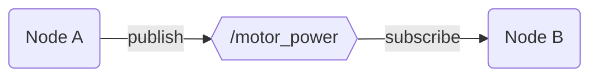
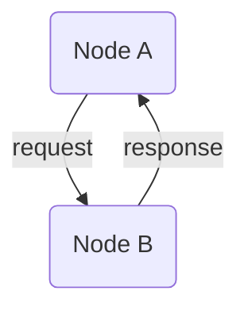

# ROS Fundamentals | [09/19/2021]

## Agenda

1. Software recap
2. Details
3. ROS2 Primer
4. Docker
5. Obstacle avoidance and SLAM

## Software recap

We are in charge of the remote and autonomus operation of the robot. In pursuit of this goal, we have two primary objectives.

1. LK Library - all of the low level hardware control apis.
2. LK Robot - high level robot controls and mission control communication.

## Details

```yaml
Lunar Knights: Software

LK Library:
	hardware: # robot independent code
		- stepper.cpp
		- talon.cpp
		- zed.cpp
	subsystems: # robot dependent code
		- drivetrain.cpp
		- intake.cpp
	utils:
		- logging.cpp
	lkpy: # Python C Extensions
		- module.cpp
		- setup.py

LK Robot:
	- teleop.py # remote control handler
	autos: # auto tasks
		- mining.py
		- navigation.py
	dashboard: # non-ROS based backend server for robot info
		- app.py
		templates:
			- index.html
		static:
			- index.js

LK Client:
	- client.py # encode gamepad inputs and send to robot
```

## ROS2 Primer

Documention: [https://docs.ros.org/en/foxy/index.html](https://docs.ros.org/en/foxy/index.html)

ROS 2 can be thought of as a middleware based on an anonymous publish/subscribe mechanism. The ROS graph is the primary mechanism for which a network of nodes communicate.

### Graph Concepts

1. _Node_ - an entity that uses ROS to communicate with other nodes.
2. _Message_ - a ROS data type used when subscribing or publishing to a topic.
3. _Topic_ - a housing for particular messages. Nodes can subscribe to a topic to receive messages or publish messages to a topic.
4. _Discovery_ - the process through which nodes determine how to connect.

Pub/sub nodes utilize a data stream to send and recieve messages. We can instead use a service/client nodes to request data. This acts like a traditional REST API where we send a request to a server and recieve a response.

Nodes can contain both publishers and subscribers to help synchronize actions. For example, consider a node that publishs to the `/motor_power` topic. It may want to subscribe to the `/distance_sensor` topic so it knows when to cut motor power.

#### Simple pub/sub



#### Simple service



### Gazebo Primer

Documentation: [http://gazebosim.org/tutorials](http://gazebosim.org/tutorials)

Gazebo is robot simulation program that allows for rapid development without a physical robot. ROS2 integrates nicely with Gazebo allowing us to control a virtual robot with the same ROS2 code. You can also write custom Gazebo plugins to control the virtual robot.

`gazebo <file.world>` starts the gazebo server and client. You can model directly in Gazebo, or use a urdf converter to generate compatible files from CAD models.

## Docker

### Install

If you have a Linux machine you do not _have_ to use Docker. For everyone else, you can install ROS2 natively but for simplicity we will use Docker containers. This will help ensure the code you write on your machine will work on the robot. Installing Docker is also significantly easier than installing ROS2.

Go to: [https://docs.docker.com/get-docker/](https://docs.docker.com/get-docker/)

Here are two images with ROS2 you can use:

```bash
docker pull osrf/ros:foxy-desktop
docker pull tiryoh/ros2-desktop-vnc:foxy
```

### Simple Example

First, start a ROS2 container with a demo publisher node.

```bash
docker run -it osrf/ros:foxy-desktop
ros2 run demo_nodes_py talker
```

Then, start another ROS2 container with a demo subscriber node.

```bash
docker run -it osrf/ros:foxy-desktop
ros2 run demo_nodes_py listener
```

The first terminal will have output similar to this:

```bash
[INFO] [1632017772.938123800] [talker]: Publishing: "Hello World: 0"
```

The second terminal will have output similar to this:

```bash
[INFO] [1632017775.940565000] [listener]: I heard: [Hello World: 3]
```

### Shared Volumes

In order to "save" our work outside of a container, we will use a shared volume.

```bash
mkdir /docker_volume
docker run -it -v /docker_volume:/shared osrf/ros:foxy-desktop
```

Now anything we put in `/docker_volume ` will be shared across the container and our host machine. All relevant code should be put in this folder for safe keeping. This will also allow you to use your IDE of choice while developing. Be careful with this as your container is no longer 100% isolated from your host machine.

### Virtual Network Computing (VNC)

VNC is a graphical desktop-sharing system that allows us to get a GUI for our Docker containers.

```bash
docker run -p 6080:80 -p 5900:5900 --shm-size=512m -e VNC_PASSWORD=123 tiryoh/ros2-desktop-vnc:foxy
```

You can use a VNC viewer and go to: `vnc://127.0.0.1:5900` or use a browser and go to: `localhost:6080`. The password is 123. You will see a Desktop enviroment to use for any GUI applications. This will be particularly useful for running Gazebo.

### Gazebo Example

```bash
docker run -p 6080:80 -p 5900:5900 --shm-size=512m -e VNC_PASSWORD=123 -v \
/Users/sachin/docker_tests/shared:/shared tiryoh/ros2-desktop-vnc:foxy
```

First terminal (in the GUI):

```bash
cd /shared/model1 && gazebo world.world
```

Second terminal:

```bash
ros2 topic pub /demo/cmd_demo geometry_msgs/Twist '{linear: {x: 1.0}}' -1
```

Third terminal:

```bash
ros2 topic echo /demo/odom_demo
```

## Obstacle Avoidance and SLAM

We need to ensure our robot does not run into obstacles. We could do this task via remote control; however, there is latency for every input. In addition, we get more points for more autonomy.

_What do we need to avoid?_ Craters, boulders and walls.

When avoiding obstacles we need to maintain an overall heading. For example, if we turn left, we need to eventually turn right to end up in the right place.

This problem can be divided into two parts: detection and avoidance.

### Detection

1. LIDAR (Light Detection and Ranging) - Uses time of flight of laser pulses to determine the distance of a particular point. This method is very accurate but is expensive. Additional care is also needed to obtain more than a single distance measurement. Most LIDAR units use a rotate disk to gain a 360 view across a single plane.
2. Structured light - Uses a projection of fixed patterns to code the distance of every pixel in an image. This method quickly obtains depth data but is sensitive to lighting variations and can interfere with other units.
3. Stereo cameras - Uses a dual camera approach similar to human eyes to approximate depth. This method can have lots of noise and doesn't perform well in low-complexity enviroments (such as a plain colored wall). Some cameras will add a IR pattern projector to add additional feature points for enhanced accuracy (iPhones use this approach).

Once we have a 2D map of depths in front of the robot, we must understand what is actually an obstacle. If we know what is normal, we can compare the observed with the expected to see what is in the way.

### Avoidance

Simultaneous localization and mapping (SLAM) is helpful for avoiding obstacles. Whenever we detect an obstacle we can mark its location relative to the robot. Then as the robot moves about, we use that obstacle as a reference point for localizing our location. This gives us a map of our enviroment that we can use to navigate through with standard motion planning algorithms.
