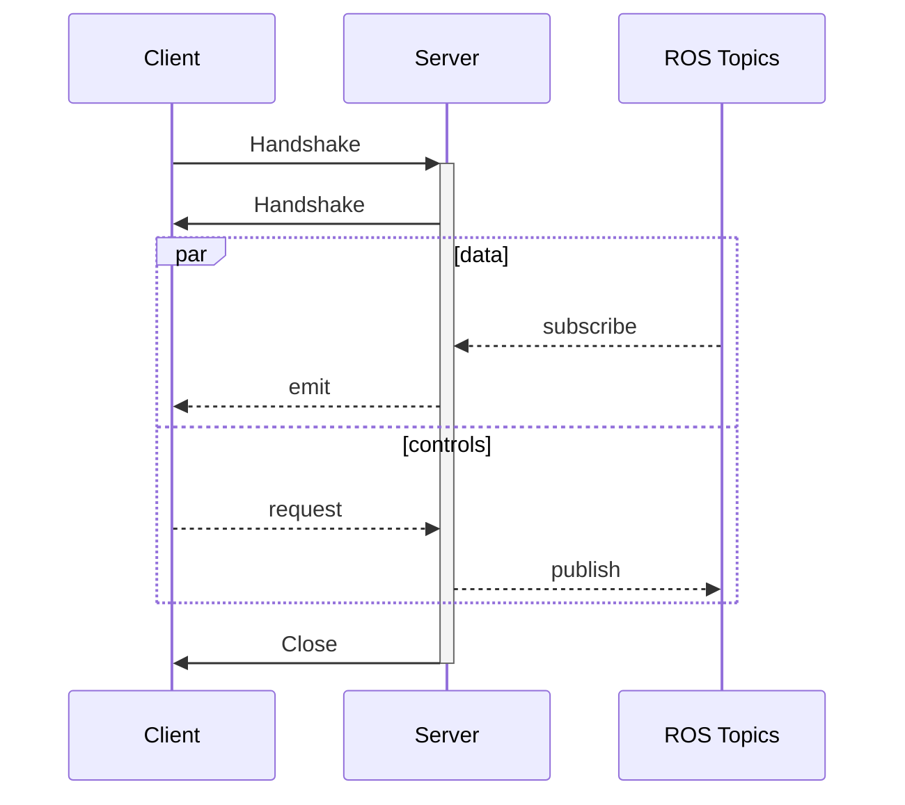
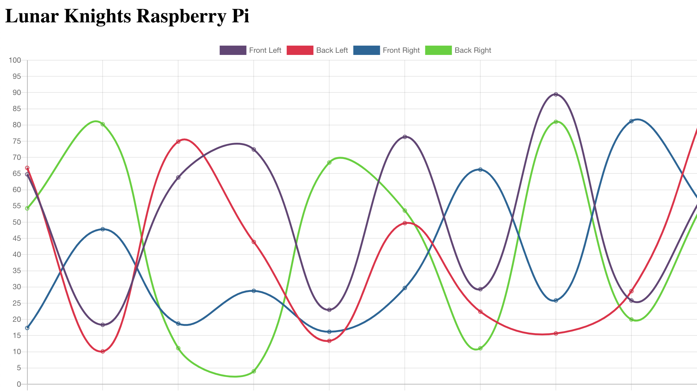
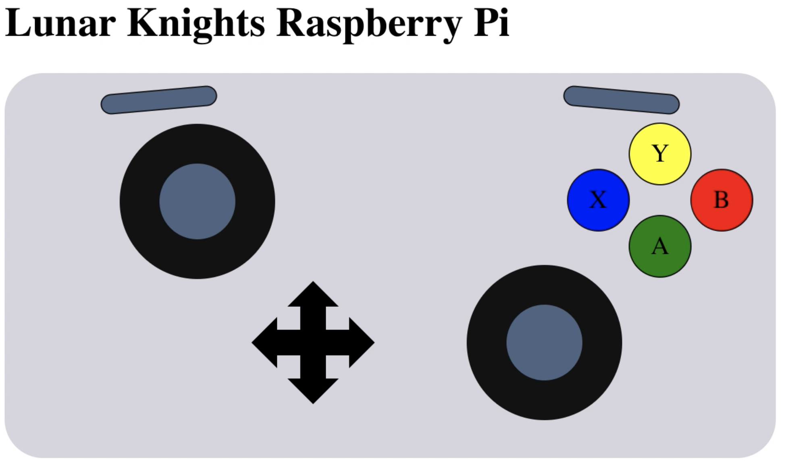

## Agenda

1. Recap
2. Project Plan
3. Gazebo Simulation
4. Web Dashboard
5. Sensor Research

## Recap

We will use ROS2 to control our robot with publishers and subscribers. To get started with development, use a ROS2 Docker container where you can use the core ros packages and gazebo.

## Project Plan

For the month of October we will work on a few specific projects that require minimal physical robot access. Right now we will pitch 3 potential projects.

1. Gazebo Simluation
2. Web Dashboard
3. Electrical Hardware Abstraction Layer

## Gazebo Simulation

Goal: Create a ROS-enabled virtual robot in Gazebo.

Using a virtual robot to develop with will increase our ability to work quickly and asynchronously. We will work with the mechanical team to convert our robot CAD into the Unified Robot Description Format ([URDF](http://wiki.ros.org/urdf/Tutorials)). Then, we will set up and develop relevant ROS plugins to control the virtual robot with ROS nodes.

### Code Snippets

#### Sample Gazebo world outline file

```xml #
<?xml version="1.0"?>
<sdf version="1.6">
	<world name="default">
		<model name='robot'>
			<link name='body'> <!-- simulation info --> </link>
			<link name='wheel'> <!-- simulation info --> </link>

			<joint name='motor' type='revolute'>
				<parent>body</parent>
				<child>wheel</child>
				<!-- simulation info -->
			</joint>

		<plugin name='skid_steer_drive' filename='libgazebo_ros_diff_drive.so'>
			<!--parameters -->
		</plugin>

		</model>
	</world>
</sdf>
```

#### Simple ROS Publisher and Subscriber

Examples with Python and C++ API: [https://github.com/ros2/examples](https://github.com/ros2/examples).

```python #
# pub
node = rclpy.create_node('minimal_publisher')
publisher = node.create_publisher(String, 'topic', 10)

publisher.publish(String('Hello!'))

# sub
node = rclpy.create_node('minimal_subscriber')
subscription = node.create_subscription(
	String, 'topic', lambda msg: node.get_logger().info('I heard: "%s"' % msg.data), 10)
```

### Resources

-   URDF: [http://wiki.ros.org/urdf/Tutorials](http://wiki.ros.org/urdf/Tutorials)
-   Solidworks to URDF: [http://wiki.ros.org/sw_urdf_exporter](http://wiki.ros.org/sw_urdf_exporter)
-   ROS & Gazebo: [http://gazebosim.org/tutorials?cat=connect_ros](http://gazebosim.org/tutorials?cat=connect_ros)
-   Plugins: [https://github.com/ros-simulation/gazebo_ros_pkgs](https://github.com/ros-simulation/gazebo_ros_pkgs)

## Web Dashboard

Goal: Access robot information and control basic motions.

Controlling the robot with ROS is neat, but can be difficult to work with. We would like a visual dashboard to quickly see critical robot information. The goal is we can utilize this dashboard on any non-ROS device (such as a phone). The dashboard should have basic robot controls (shutdown, start task, etc) and access to all robot data (imu, current, etc). This project involves two parts: the front-end dashboard for browser viewing and the back-end server running on the robot.

### Basic Comms



### Inspiration

| Current Plots                     | Gamepad Display                   |
| --------------------------------- | --------------------------------- |
|  |  |

### Resources

-   Python Flask: [https://flask.palletsprojects.com/en/2.0.x/](https://flask.palletsprojects.com/en/2.0.x/)
-   Flask Sockets: [https://flask-socketio.readthedocs.io/en/latest/getting_started.html](https://flask-socketio.readthedocs.io/en/latest/getting_started.html)
-   JavaScript Sockets: [https://socket.io/docs/v4/](https://socket.io/docs/v4/)
-   ReactJs: [https://reactjs.org/](https://reactjs.org/)

## Hardware Research

Goal: Determine what sensors we should invest in. Cost analysis, how do we control them, basic specs, etc.

[Coming Soon]
